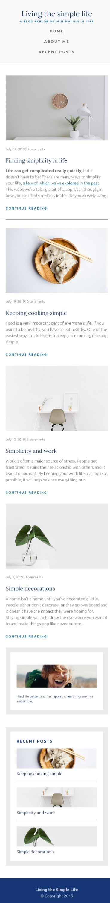
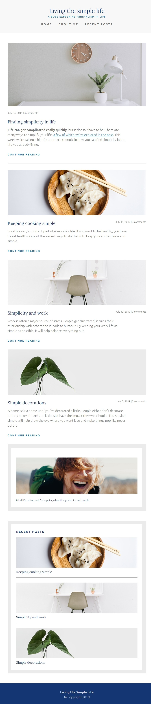
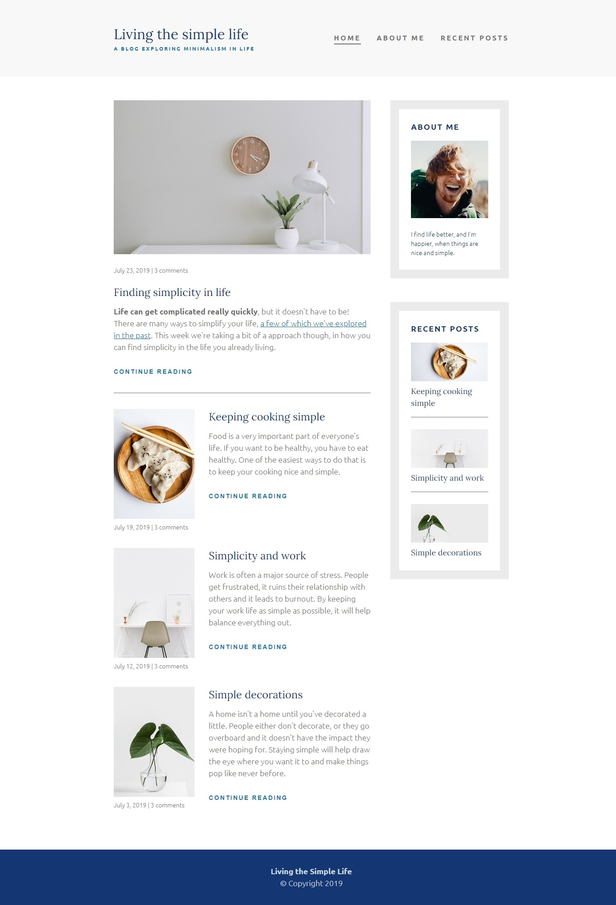

# Kevin Powell - Introduction To Responsive Web Design, Simple Life

This is my solution to [Kevin Powell's HTML & CSS Tutorial](https://www.youtube.com/watch?v=srvUrASNj0s&t=8202s) avaiable on freeCodeCamp.org youtube channel.

## Table of contents

- [Overview](#overview)
  - [The challenge](#the-challenge)
  - [Screenshot](#screenshot)
- [My process](#my-process)
  - [Built with](#built-with)
  - [What I learned](#what-i-learned)

## Overview

### The challenge

Main learning points of following this tutorial:

- View the optimal layout for the interface depending on their device's screen size
- **Bonus from myself**:
  - Add accessible links
  - Use Sass preprocessor
  - Use pseudo-selectors
  - Use em and rem instead of px

### Screenshot





## My process

I started out with reviewing the concept at the beginning of tutorial. Next, I opened the [resource provided by Kevin](https://xd.adobe.com/spec/75d448ea-569a-4b7e-721b-9bbd3b2b97b9-03e5/grid) and coded the whole page with scss by myself. Lastly, I reviewed the second part of tutorial to notice and correct any mistakes in my project, e.g. missing <aside> element, messy paddings and margins.
As last touch-up, I checked the accessibility of the website with tabs, added few links and a skip-link at the top of page.

### Built with

- CSS custom properties
- Flexbox
- Mobile-first workflow
- SCSS syntax with variables and mixins
- BEM

### What I learned

- Picture manipulation with aspect-ratio property

- Usage of pseudo-selectors in SCSS
  [Helpful resource](https://css-tricks.com/the-sass-ampersand/)

  ```css
  .article-sidebar {
    &:not(:last-child) h3 {
      margin-block-end: 1em;
    }
  }
  ```

- Good practices of writing code

Kevin Powell pointed out that specifying element's bottom margin is usually better than mixing it with top margins and paddings. This practice is especially useful when the website is populated with more content the problem with reorderring elements and readjusting margins doesn't appear.
